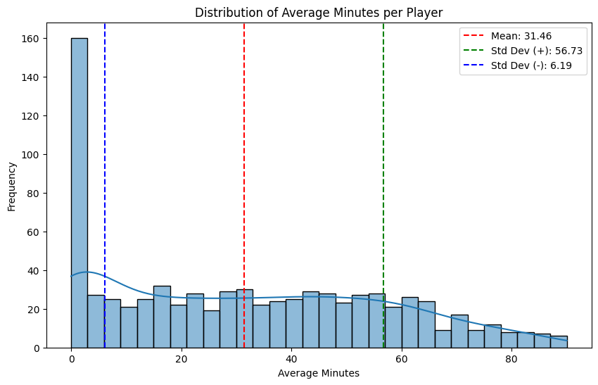
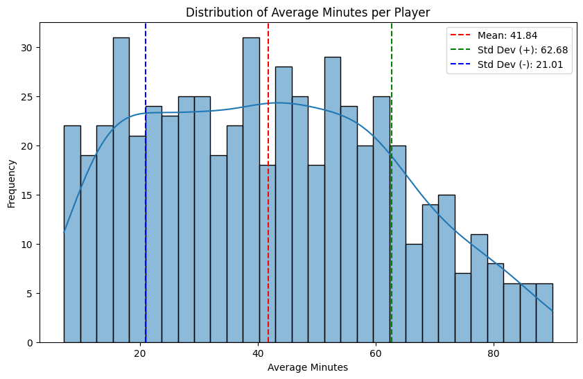
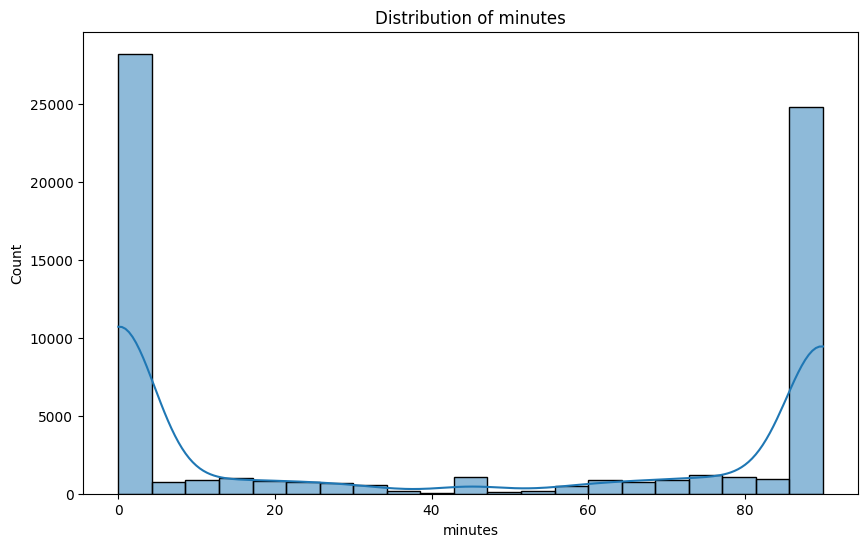
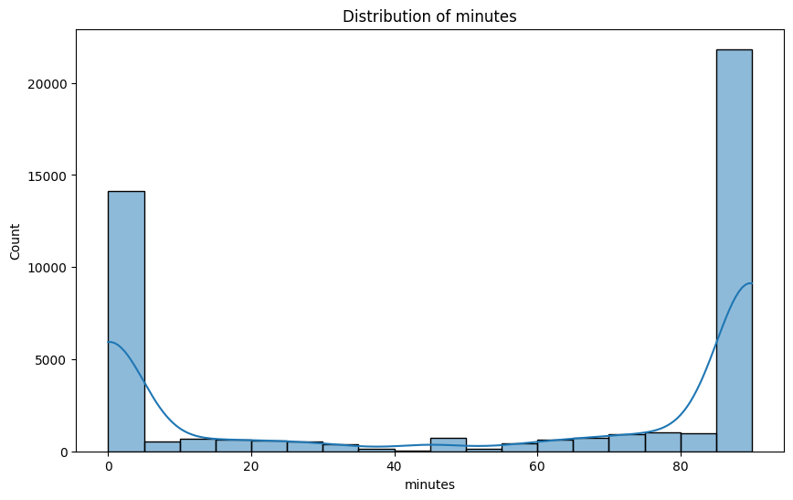

# Further Analysis

Following this we try to remove any data that wont help in generating the model

THis includes
* Players that have an average play time below a certain threshold

When checking these we can see that there are a lot of players who never play! THis makes sense when you consider that there are 20 teams each with 11 players each ~200 players. obviously there are subs and team changes so we can go to 4-500. SO ~16 players that never play is feesable.

We will atleast remove the players with 0 mins and for now, below 1 standard deviation.

After removing, we get a distribution like this:

However if we look at the minutes distribution, we still have too much 0 data

If we remove below the average we get something closer to reasonable:

Maybe come back to this at a later stage.

In terms of columns, we will start with fewer columns. As we know how points are calculated we can remove everything that is directly correlated like goals and assists. ICT is worth keeping and means we can remove the individual contributers like influence as they are strongly correlated. BPS gives some extra fine detail on performance so we will keep this. Penalties, cards and team score are not correlating to points so they can be removed. Was home also is not correlated so don't keep.

We end up with a final list:
* bps
* ict_index
* kickoff_time
* minutes
* value
* position
* points