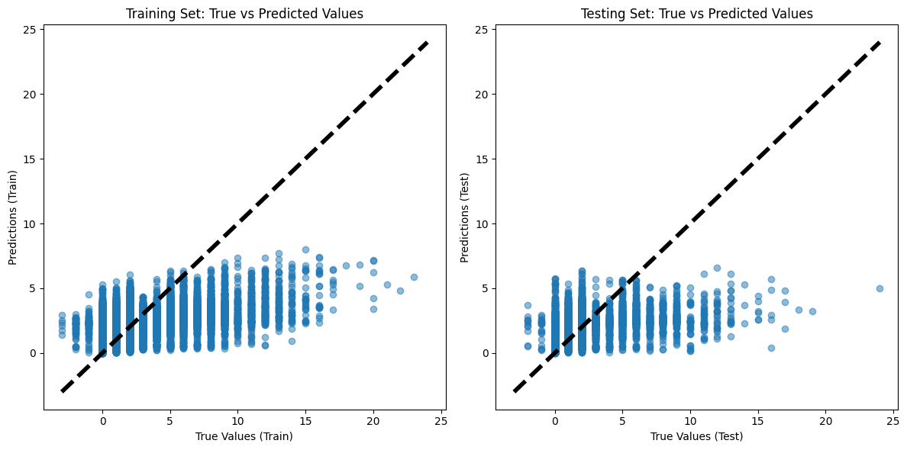
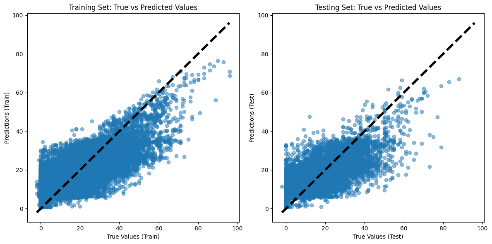
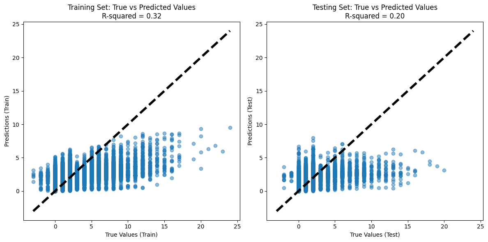
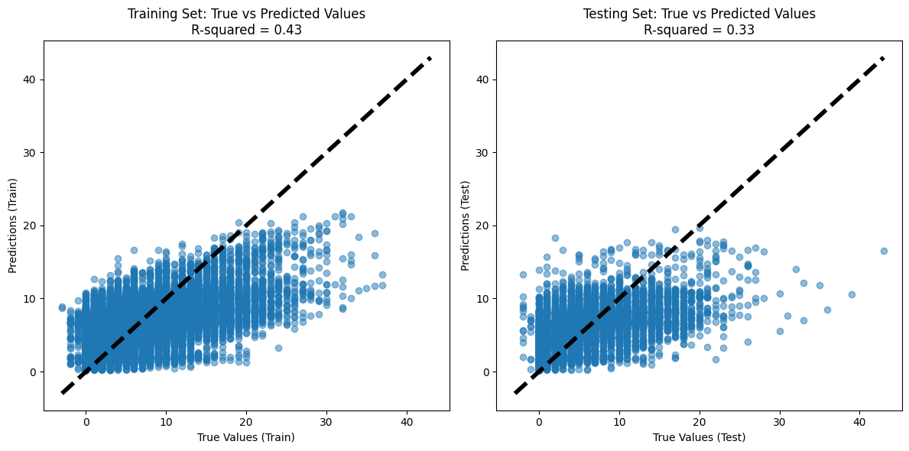
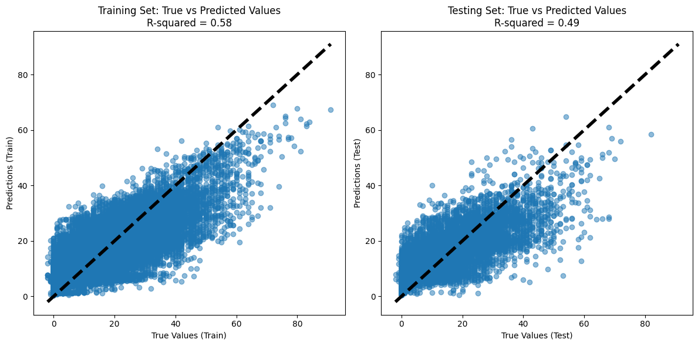
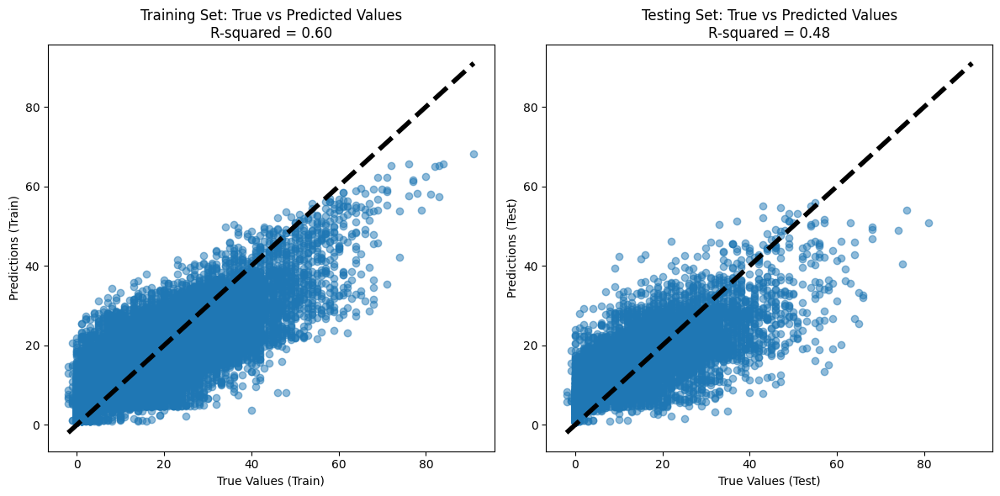
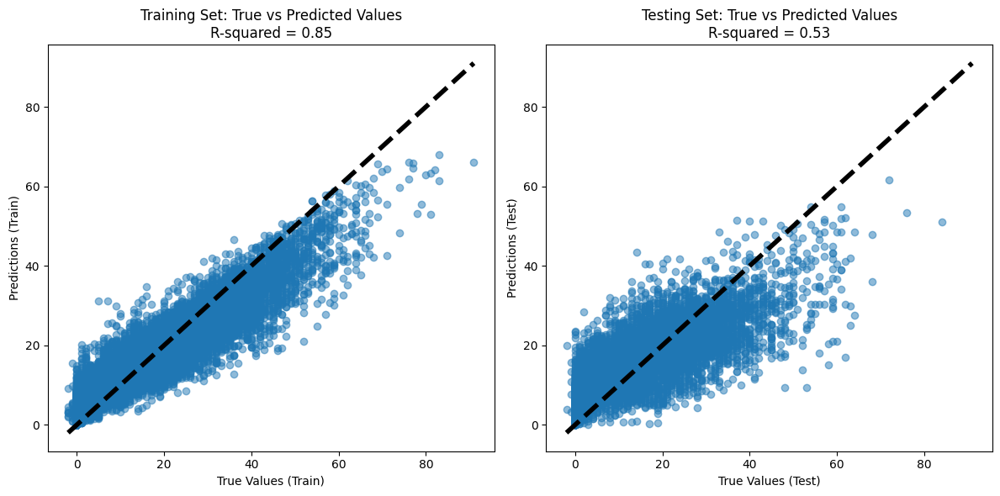
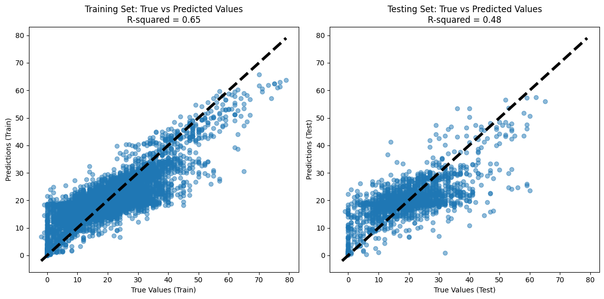
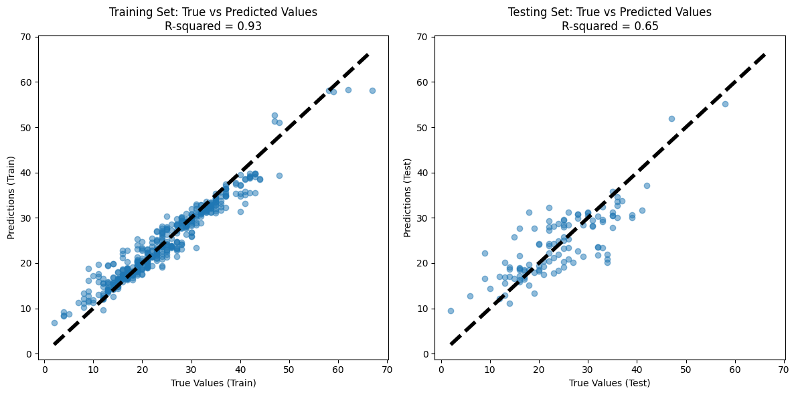

# Simple Regression

Now that we have our data, we start with some simpler regression models. Our data consists of 4 previous fixtures, trying to predict the total of the next three fixtures as we are looking for medium term performance of the players.

# Random forest

After testing a range of parameters from a subset of the data we find the the best model so far can produce an R^2 value of 0.32. Not great, but better than my previous attemtpts

Minutes played, bps and value from the previous week are the most important feautures suggesting not much can be gained linearly from the previous weeks performance.

From here we try predicting 1 fixture from 2 and 10 fixtures from 11. Trying to get the exact score from the previous two games is unsurprisingly difficult and we only see an R^2 of 0.2

Using the previous 11 to predict sum of 10 fixtures we get an R^2 of around 0.5 So better but this is just because the variance ill go down with more weeks selected. Seems like predicting 3 games could be a good middle ground. I may test this further at a later date

In a practical sense. I fwe have an fpl team with 15 players, and can make 2 changes per week on average, we want to be sure that the plaers will perform for at least 8 weeks, so that every wwek we can bring in the best players for that week.

# Random Forest P2

After some reworking of the pipeline we run a series of tests:
* Amount of data for prediction
* Amount of data to predict
* Min minutes for players to keep

First we look at 3 fixtures to predict 1/3/8 games

THen we check amound of prediction fixtures with 3/7/20 fixtures to predict 8

Finally we focus on the players that play most often. With average mins above 30/60/80:

We can see that predicting 8 fixtures with 3 and focusing on players above 80 mins gives the best performance.