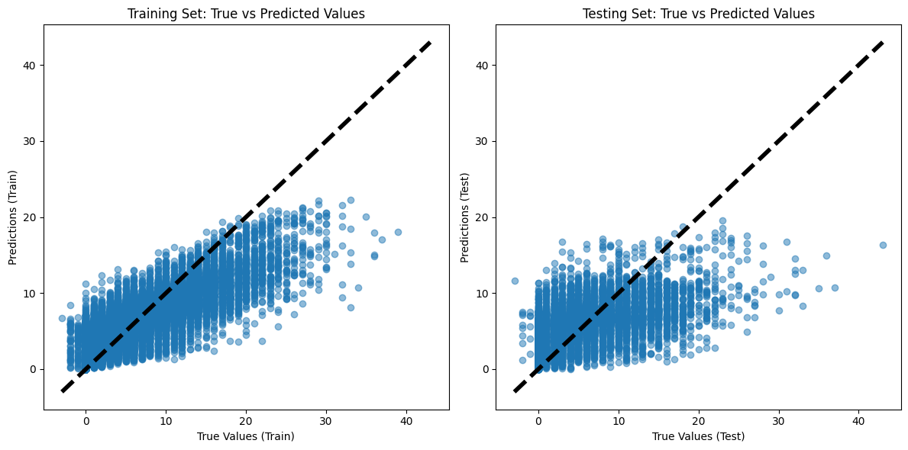

# Simple Regression

Now that we have our data, we start with some simpler regression models. Our data consists of 4 previous fixtures, trying to predict the total of the next three fixtures as we are looking for medium term performance of the players.

# Random forest

After testing a range of parameters from a subset of the data we find the the best model so far can produce an R^2 value of 0.6. Not bad!

